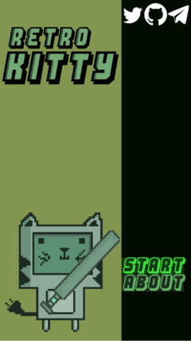

# Portfolio

## Index:

1. [Personal Projects](#personal-projects)
2. [Tools](#tools)
3. [Mods](#mods)

---

# Personal projects

## [cp-swf (Elm)](https://github.com/aBARICHELLO/cp-swf)

An interactive archive for old Club Penguin SWF files. Load different versions, rooms and events of the game, all in the same page. 
The [archive](https://gitlab.com/BARICHELLO/cp-swf-archive) is easy to contribute to, just drop new folders/files and the front-end reflects the directory structure automatically.

<figure>
    
    <figcaption><i>Click the image to go to the website</i></figcaption>
</figure>

*(This project no longer works on modern browsers due to dropped Flash support).*

## [multicaster (C++ / SFML)](https://github.com/aBARICHELLO/multicaster/)

Game using Raycasting techniques for rendering, the same used by Wolfenstein 3D and DOOM to make a 2D world with a fake 3D perspective.

Built using C++ and SFML (Simple and Fast Multimedia Library) to handle all low level operations like rendering to screen, loading sprites, playing audio and others.

<figure>
    
    <figcaption><i>Raycasting untextured prototype</i></figcaption>
</figure>

Using GitLab CI's pipelines I could setup an environment where after every commit the game is compiled and a `.zip` is generated with all the dependencies included. This enables the player to simply download, extract and immediately be able to play your game.

Packages are generated for Windows and Linux, download links and CI configuration can be found on the [GitLab mirror](https://gitlab.com/BARICHELLO/multicaster).

## [Arbochelli (Haxe/Caddy)](https://github.com/abarichello/arbochelli)

A self-hosted personal blog that I use to host bass guitar sheet music for free. The blog uses [Hexo](https://github.com/hexojs/) as the static site generator, [Caddy](caddyserver.com/) as the HTTP server and [Umami](https://github.com/mikecao/umami) for analytics. Comments are hosted on GitHub using [utterances](https://github.com/utterance/utterances).

<figure>
    
    <figcaption><i>The website is hosted at <a href="https://aa.art.br">aa.art.br</a> and <a href="https://arbochelli.me">arbochelli.me</a>.</i></figcaption>
</figure>

All scripts are written using the [Haxe programming language](https://haxe.org) that compiles to multiple targets. Client-side scripts use the JavaScript target while server-side scripts are interpreted using the `--interp` [macro](https://haxe.org/manual/compiler-usage.html#common-arguments). Server side scripts include a tool that automatically creates a post for every new Youtube video based on its description.

## [ENE (Elm)](https://github.com/caravelahc/ene)

Every Brazillian citizen can use the [falabr.cgu.gov.br](https://falabr.cgu.gov.br) website to request data from government institutions. ENE is designed to process and display statistics from my university such as approval rates of students by course and semester.

<figure>
    
    <figcaption><i>Example of a popular course.</i></figcaption>
</figure>

Other contributions to [Caravela Hacker Club](https://github.com/caravelahc):
- [cagrex](https://github.com/caravelahc/cagrex)
- [capim](https://github.com/caravelahc/capim)

## [GAMINE (GDScript)](https://github.com/aBARICHELLO/gamine)

Gamine is a recreation of the Enigma Machine minigame that's featured in Wolfenstein - The New Order. The goal was to recreate the minigame from the ground up using original assets and code.

<figure>
    
    <figcaption><i>GAMINE</i></figcaption>
</figure>

<figure>
    
    <figcaption><i>Enigma Machine from Wolfenstein II</i></figcaption>
</figure>

## [RetroKitty (GDScript)](https://github.com/aBARICHELLO/RetroKitty)

Casual mobile game developed using the Godot Engine. Your objective is to hit the color coded balls in the given order, offers both scripted and random gamemodes.

Since it is a color based game it was designed from scratch to be colorblind-friendly using textures to differentiate no matter what color deficiency you have.

    
    

## [Amnesia Brawl (C++)](https://github.com/aBARICHELLO/amnesia-brawl)

<figure>
    
    
</figure>

Local multiplayer brawl game made with C++ using SFML(Simple and Fast Multimedia Library) and the Box2D library for physics. Available on [Itch.io](https://barichello.itch.io/amnesia-brawl).

---

## Tools

## [godot-ci (Docker)](https://github.com/aBARICHELLO/godot-ci)

Docker image to export debug versions of Godot games to multiple targets.
Includes templates using GitHub Actions/GitLab CI to deploy your games to these services:

- GitHub Pages
- GitLab Pages
- Itch.io

Also supports multiple godot versions due to the contributions from multiple [community members](https://github.com/aBARICHELLO/godot-ci/graphs/contributors).

<figure>
    
</figure>

---

## Mods

## Unity mods

- [Receiver 2](https://github.com/aBARICHELLO/receiver2-qol-fixes/) - Quality of life fixes.
- [Firewatch-noclip](https://github.com/aBARICHELLO/Firewatch-noclip) - Noclip.
- [far-lone-sails-noclip](https://github.com/aBARICHELLO/far-lone-sails-noclip) - Noclip.
- [Syberia 3](https://github.com/aBARICHELLO/syberia3-noclip) - Noclip.
- [Slime Rancher](https://github.com/aBARICHELLO/slimerancher-superjet) - Resource modification mod.
- [Sir You Are Being Hunted](https://github.com/aBARICHELLO/SYABH-mods) - Resource modification mod.
- [This Is The Police](https://github.com/aBARICHELLO/PoliceMods) - Novid mod (removes cutscenes).

## Cheat Engine mods

- [INSIDE](https://github.com/aBARICHELLO/inside-noclip) - Noclip.
- [Mini Ninjas](https://github.com/aBARICHELLO/minininjas-noclip) - Noclip.

---

\ (•◡•) /

---
